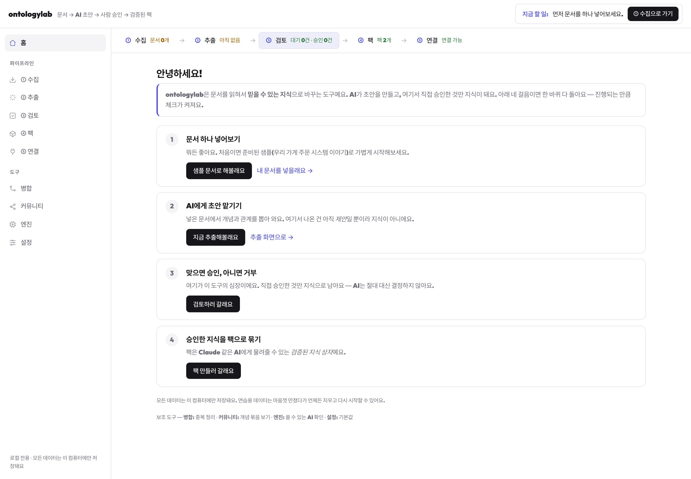
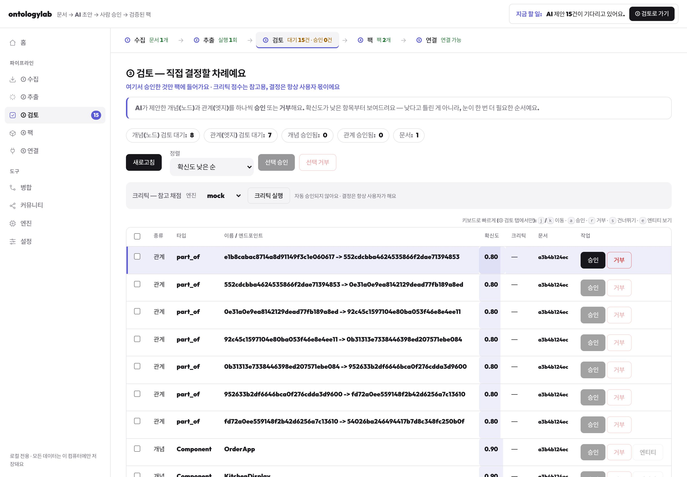
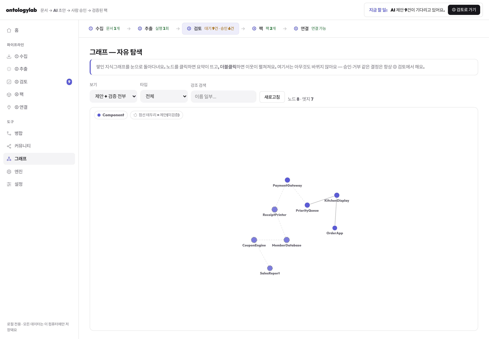

# ontologylab

[](https://github.com/dltdnfrk/ontologylab/actions/workflows/ci.yml)


Local-first, single-user **knowledge-graph pipeline**:

```
collect → extract (LLM) → verify (human) → knowledge pack → local MCP server
```

**The AI proposes; a human decides; only verified facts ship.** Every
extracted node/edge is born `proposed` and becomes `verified` only through an
explicit human approval. Packs are immutable, verified-only snapshots, and the
MCP surface is strictly read-only — see
[`docs/DESIGN-RATIONALE.md`](docs/DESIGN-RATIONALE.md) for the 36-paper
evidence base behind this design.

Neutral domain only (software / technical docs / general knowledge). No cloud,
no multi-user, all data stays on your machine.

| Guided pipeline | Review queue (HITL gate) | Graph browser |
|---|---|---|
|  |  |  |

## Requirements

- Python **3.11+** (a system `python3` at 3.8 is not enough)
- Optional: `claude` / `codex` / `gemini` CLI — or any Anthropic/OpenAI-compatible
  API registered as a provider — for live extraction; `mock` works offline

## Install

```bash
cd ontologylab
python3.13 -m venv .venv
.venv/bin/pip install -e ".[server,mcp,test]"
# if extras fail on an older setuptools:
.venv/bin/pip install -e . pytest httpx fastapi 'uvicorn[standard]' 'mcp>=1.2'
```

## Local dashboard

```bash
python -m ontologylab.serve --host 127.0.0.1 --port 8765
# open http://127.0.0.1:8765
```

A workflow-first SPA (Korean UI) covering the whole pipeline: guided home,
collect (URL / file / paper APIs), extraction jobs (**live status over SSE**,
polling fallback), the review queue with keyboard-first bulk approve/reject and
an entity evidence panel, entity-merge review, community view, pack build +
diff + one-file `.mcpb` bundling, and a **read-only graph browser**
(force-layout, pan/zoom, neighbor expansion, status/type filters).

**One-click launch (macOS):** `bash launcher/build-macos-app.sh` builds a
double-clickable `ontologylab.app` into `~/Applications`. 한글 실행 가이드:
[`launcher/README.md`](launcher/README.md).

## CLI

```bash
# ingest a local file (or --url against allowlisted hosts)
python -m ontologylab.main collect --file ./docs/note.md

# extract with mock (offline) or claude (live)
python -m ontologylab.main extract --engine mock

# human verification gate
python -m ontologylab.main review
python -m ontologylab.main approve --id <node_or_edge_id>
python -m ontologylab.main reject --id <id>

# build immutable verified-only pack
python -m ontologylab.main build-pack --name my-pack
```

## MCP server

```bash
python -m ontologylab.mcp_server --packs-dir ./packs
# optional pin: --pack <pack_id>
```

Claude Desktop / Claude Code snippet:

```json
{
  "mcpServers": {
    "ontologylab": {
      "command": "/path/to/ontologylab/.venv/bin/python",
      "args": ["-m", "ontologylab.mcp_server", "--packs-dir", "/path/to/ontologylab/packs"]
    }
  }
}
```

10 tools, all read-only against the pack: `list_packs`, `load_pack`,
`get_schema`, `entity_lookup`, `get_entity`, `semantic_search` (FTS5 lexical;
optional fail-open LLM query expansion via `expand=True` +
`--expansion-engine`), `graph_query`, `traverse_relations`, `find_path`,
`get_communities`. Packs can also ship as a single-file `.mcpb` bundle for
drag-and-drop install into Claude Desktop.

## Tests

```bash
.venv/bin/pytest -q   # 350+ tests, fully offline
```

CI runs the same suite on Python 3.11/3.12 plus a dashboard JS syntax check.

## Docs

- [`docs/ARCHITECTURE.md`](docs/ARCHITECTURE.md) — data model, HITL invariants, MCP contracts
- [`docs/DESIGN-RATIONALE.md`](docs/DESIGN-RATIONALE.md) — literature dossier (36 verified papers)
- [`docs/ROADMAP.md`](docs/ROADMAP.md) — M0–M8 + post-MVP waves
- [`HANDOFF.md`](HANDOFF.md) — implementation status & session handoff
