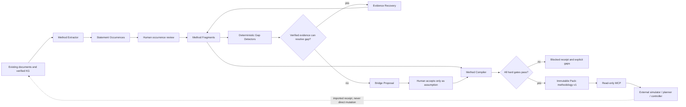

# OntologyLab Methodology Compiler Architecture

Status: implementation-ready design candidate
Date: 2026-08-11
Scope: provenance-preserving methodology synthesis only
Product boundary: OntologyLab compiles declarative packs; it does not execute methods or control systems.

## 1. Decision

OntologyLab의 다음 확장은 범용 에이전트나 자동 연구자가 아니라 **Methodology
Compiler**다.

기존 파이프라인은 유지한다.

```text
collect -> extract -> human verify -> immutable knowledge pack -> read-only MCP
```

그 위에 검증 전 작업공간과 방법론 컴파일 단계를 추가한다.

```text
documents
  -> StatementOccurrence
  -> MethodFragment
  -> deterministic Gap
  -> evidence recovery | BridgeProposal
  -> human decisions
  -> non-compensatory compile gates
  -> immutable Knowledge Pack with methodology-v1 capability
  -> read-only MCP
  -> external simulator / planner / controller
```

핵심 결정은 다음과 같다.

1. Existing graph는 evidence substrate로 재사용하되 Method IR 자체는 일반 KG
   `nodes`/`edges`에 넣지 않는다.
2. `StatementOccurrence`를 포함한 Method IR은 기존 live SQLite 안의 별도 정규화
   테이블에 둔다.
3. `MethodStore`는 새 연결을 소유하지 않는다. `MethodUnitOfWork`가 기존 SQLite
   connection을 빌리고 transaction commit/rollback을 단독 소유한다.
4. source-backed evidence와 accepted assumption은 영구적으로 분리한다. Bridge는
   `verified edge`가 될 수 없다.
5. pack에는 검토 작업공간 전체가 아니라 canonical Method JSON, source index,
   compiler receipt만 출고한다.
6. 기존 Knowledge Pack을 확장하며 별도 배포 런타임을 만들지 않는다.
7. MCP는 조회만 제공한다. 실행·스케줄링·setpoint·actuator 호출은 금지한다.
8. 모든 release gate는 비보상적이다. 한 gate의 점수가 다른 실패를 상쇄하지 못한다.

## 2. Existing constraints that remain authoritative

| Constraint | Current evidence | Design consequence |
|---|---|---|
| local-first, single-user | `docs/ARCHITECTURE.md:1-12` | SQLite와 현재 launcher/runtime을 유지한다. |
| LLM output is proposed, not knowledge | `docs/ARCHITECTURE.md:150-205`, `docs/DESIGN-RATIONALE.md:1-20` | 방법론 추출과 bridge 생성도 자동 승인할 수 없다. |
| verified-only publication | `ontologylab/packbuilder.py:283-636` | compiler는 accepted source-backed 필드만 factual lane에 넣는다. |
| immutable pack publication | `ontologylab/packbuilder.py:343-636` | 방법론 수정은 새 pack을 만든다. 기존 pack을 갱신하지 않는다. |
| one owned SQLite connection | `ontologylab/kgstore.py:550-629` | 새 store는 connection을 합성하고 독립 DB를 만들지 않는다. |
| resumable extraction lifecycle | `ontologylab/extractor.py:700-833`, `ontologylab/extraction_state.py:1-420` | method extraction도 run/chunk identity와 재시작 영수증을 가진다. |
| advisory critic only | `ontologylab/critic.py:1-20`, `ontologylab/conformal.py:1-24` | critic/conformal은 정렬·abstention에만 사용한다. |
| read-only MCP over immutable pack | `ontologylab/mcp_server.py:1-55`, `ontologylab/mcp_server.py:430-1150` | write/execute tool을 추가하지 않는다. |
| standard-library core | `pyproject.toml:1-30` | 새 core는 필수 외부 DB·ML·validation dependency를 추가하지 않는다. |

## 3. Bounded contexts

### 3.1 Existing Evidence Graph

Ownership remains with `KGStore`.

- documents and exact source spans
- ontology schema
- proposed/verified/rejected entities and relations
- citations, source grade, provenance
- search, communities, staleness, pack snapshot

Methodology code may reference these records but must not reinterpret a generic KG edge as a
method step.

### 3.2 Method Workspace

Ownership belongs to `MethodStore`, composed over the same SQLite connection.

- statement occurrences
- typed fragments and field-level evidence
- step dependencies and conditions
- deterministic gaps
- bridge proposals and counter-evidence
- human decisions
- compilation attempts and receipts

This context is mutable and never served directly to MCP. It is the authoritative source for
methodology semantics; Method objects are never dual-written to generic graph nodes or edges.

### 3.3 Method Compiler

A pure, deterministic boundary.

- validates the Method IR schema
- checks source anchors, content hashes, units, references, DAG reachability and rights
- separates evidence, derived structure, assumptions and operator constraints
- runs competency/replay fixtures
- emits canonical JSON and a gate receipt

The compiler never calls an LLM.

### 3.4 Pack Publication

The existing pack remains the only deployable container.

- manifest capability: `methodology-v1`
- canonical method records
- field-level source index
- explicit assumptions and unresolved gaps
- compiler and human-review receipts
- content hash and source-version lineage

### 3.5 External Consumers

Simulators, planners, digital twins and controllers are consumers, not OntologyLab modules.

- they may read a Method Pack
- they may return a replay/simulation receipt as a new untrusted artifact
- their result does not mutate a released pack
- a result enters the next release only through collection, validation and human review

## 4. Component flow



## 5. Working data model

All source selectors include `document_id`, `document_content_hash`, character offsets and a
hash of the selected text. A changed document therefore resolves to the exact old occurrence
or fails visibly as stale.

### 5.1 Rights and processor policy

#### `source_policy`

- `id`
- `origin_pattern`
- `policy_version`
- `allowed_quote`
- `allowed_extract`
- `allowed_pack`
- `allowed_train`
- `allowed_redistribute`
- `sensitivity`
- `allowed_processors_json`
- `allowed_regions_json`
- `decision_note`
- `decided_by`
- `decided_ts`

#### `document_policy_snapshot`

- `document_id`
- `document_content_hash`
- `source_policy_id`
- `resolution_status`: `resolved | discovery_only | denied | ambiguous`
- `resolved_ts`

Unresolved, denied or ambiguous records cannot enter gold evaluation, training or a released
method.

### 5.2 Method workspace tables

#### `method_workspace`

- `id`, `name`, `objective`, `scope_json`
- `method_schema_version`
- `status`: `draft | review_ready | compiled | superseded`
- `created_ts`, `created_by`

#### `statement_occurrence`

- exact source selector and selector hash
- normalized statement text
- polarity, modality, temporal scope and applicability scope
- optional references to existing KG node/edge IDs
- extractor engine/model/prompt/decode provenance
- `decision_status`: `pending | accepted | rejected | stale`
- reviewer receipt

An accepted occurrence means “the cited source says this”, not “the statement is universally
true”.

#### `method_fragment`

- `id`, `workspace_id`
- `fragment_kind`: `objective | prerequisite | input | step | condition | measurement |
  result | constraint | risk`
- canonical `payload_json`
- `epistemic_class`: `source_supported | deterministic_derivation | bridge_assumption |
  operator_constraint`
- `decision_status`: `pending | accepted | rejected | stale`
- generator/parser provenance

#### `method_fragment_evidence`

- `fragment_id`
- `field_path`: JSON Pointer into `payload_json`
- `statement_occurrence_id`
- `role`: `supports | contradicts | qualifies`

Evidence is field-level. Whole-object citation is insufficient when only some fields are
supported.

#### `method_link`

- `src_fragment_id`, `dst_fragment_id`
- `link_kind`: `precedes | requires | conditioned_by | measures | produces | invalidates`
- `decision_status`
- derivation or reviewer receipt

#### `method_gap`

- `id`, `workspace_id`
- `gap_class`
- `target_fragment_id`, optional `field_path`
- `detector_id`, `detector_version`, `input_snapshot_hash`
- `status`: `open | resolved_by_evidence | addressed_by_assumption | waived`
- deterministic detail and waiver receipt

#### `bridge_proposal`

- `id`, `gap_id`
- bounded hypothesis
- assumptions, scope and applicability limits
- falsifier and required validation
- generator provenance
- `decision_status`: `pending | accepted_as_assumption | rejected | superseded`

`accepted_as_assumption` can never be rewritten as `source_supported`.

#### `bridge_evidence`

- `bridge_id`, `statement_occurrence_id`
- `role`: `supports | counters | bounds`

Every accepted bridge requires at least one falsifier and an explicit counter-evidence search
receipt, even if that search returns none.

#### `method_release`

- `workspace_id`, `version`
- `canonical_json`, `content_hash`
- `compiler_version`
- `gate_receipt_json`
- `review_receipt_json`
- `created_ts`

Rows are append-only. Pack build copies only a release whose hard gates passed.

`MethodStore.decide(subject_kind, subject_id, decision, reviewer, note)` is the only application
write path for `decision_status` across occurrences, fragments, links, gaps and bridges. It
records one review event and applies subject-specific transition checks inside one transaction.
This avoids implementing a separate approval state machine per table while keeping the Method
IR semantically separate from generic KG facts.

`MethodStore` never calls `commit()` or `rollback()` itself. `MethodUnitOfWork` owns the operation
boundary, opens one transaction on the shared connection, and commits the Method IR mutation and
its provenance/review receipt together. Exceptions roll back the whole operation.

Pack inclusion is explicit: `build_pack(..., method_release_ids=())` defaults to no methodology
content so the current KG-only build remains behavior-compatible. The CLI accepts repeatable
release IDs, and the manifest records the exact selected IDs and hashes. It never guesses “the
latest” mutable workspace state.

## 6. Epistemic and lifecycle rules

Human acceptance and epistemic status are separate axes.

| Object | Human decision | Epistemic meaning |
|---|---|---|
| source occurrence | accepted | cited source entails the occurrence |
| source-supported fragment | accepted | every factual field is anchored to accepted occurrences |
| deterministic derivation | accepted | named deterministic rule produced it from accepted inputs |
| bridge proposal | accepted as assumption | usable hypothesis, never verified evidence |
| operator constraint | accepted | declared requirement, not an empirical fact |
| gap waiver | waived | known incompleteness accepted with named reason |

No transition exists from `bridge_assumption` to `source_supported`. New evidence creates a new
source occurrence and a replacement fragment.

## 7. Pipeline algorithm

### Stage 0 — Rights and source routing

1. Resolve the document version to a policy snapshot.
2. Select only an allowed processor and region.
3. Treat source text as untrusted data.
4. Deny tool calls, URLs, SQL, code and control actions from source content.
5. Quarantine discovery-only records from release and training.

### Stage 1 — Strict occurrence extraction

1. Reuse existing chunking, caps, kill switch, engine adapters and run identity.
2. Request only the declared `method-occurrence-v1` JSON subset.
3. Post-validate every field; unsupported schema keywords fail closed.
4. Use explicit `unknown`, `absent` and `insufficient_evidence` values.
5. Validate source offsets and selector hashes before storing a MethodStore proposal.

Syntactic validity and semantic entailment remain separate metrics.

### Stage 2 — Fragment assembly

1. Normalize entities, units, dimensions, temporal scope and references deterministically.
2. Assemble typed fragments from accepted occurrences.
3. Attach evidence to each factual JSON field.
4. Keep unknown values rather than filling required slots.
5. Submit every semantic merge to human review.

### Stage 3 — Deterministic gap detection

Initial gap classes:

- required slot missing
- factual field without accepted occurrence
- unresolved or dangling reference
- step dependency cycle
- unreachable step or result
- input/output type discontinuity
- unit or dimension mismatch
- condition without measurable criterion
- contradictory compatible-scope statements
- failed competency question or replay fixture
- stale source selector
- blocked rights or processor policy

There is no generic novelty score and no LLM-defined gap class.

### Stage 4 — Evidence recovery before bridge generation

1. Search accepted local evidence using current FTS and optional embeddings.
2. Keep source-span retrieval results and abstain below a fixed threshold.
3. If evidence closes the gap, create a new source-backed proposal.
4. Only when evidence is insufficient may the system request a bridge proposal.

GraphRAG, PPR or multi-hop reasoning is deferred until a frozen baseline proves that existing
retrieval cannot meet source-span/path recall targets.

### Stage 5 — Bounded bridge proposal

The model receives only:

- one typed gap
- bounded neighboring fragments
- allowed source occurrences
- required output schema

It must return:

- hypothesis
- assumptions
- scope
- supporting and counter evidence references
- falsifier
- minimum replay/simulation test
- abstention when evidence is insufficient

The model cannot fetch sources, call tools, change review state or compile a release.

### Stage 6 — Deterministic compilation

Canonicalization uses sorted keys, stable IDs, explicit schema versions and normalized units.
The compiler emits:

- `method.json`
- `method-source-index.json`
- `compiler-receipt.json`
- competency/replay receipts
- unresolved gap and assumption inventory

## 8. Non-compensatory release gates

| Gate | Pass condition | Hard failure |
|---|---|---|
| G0 Rights | every source and processor operation resolved | denied/ambiguous material included |
| G1 Source anchor | every factual field has a valid accepted occurrence | missing, stale or mismatched selector |
| G2 Epistemic separation | assumptions and constraints are isolated | bridge appears as verified evidence |
| G3 Structure | schema subset, references, units and dimensions valid | silently ignored keyword or fabricated value |
| G4 Method graph | DAG, reachability and input/output continuity valid | cycle, dangling ref or unreachable output |
| G5 Contradiction | blocking conflicts resolved or explicitly scoped | hidden compatible-scope conflict |
| G6 Human decision | every semantic proposal has a named decision | model/critic self-approval |
| G7 Competency/replay | required fixtures pass on frozen inputs | omitted error/no-output rows |
| G8 Pack integrity | canonical hash, atomic build and manifest receipt pass | mutable or unverifiable release |

No overall score can override a failed gate.

## 9. Pack and MCP contracts

### Pack extension

`manifest.json` adds:

```json
{
  "capabilities": ["knowledge-graph-v1", "methodology-v1"],
  "methodology": {
    "schema_version": "method-v1",
    "method_count": 0,
    "compiler_version": "method-compiler-v1",
    "selected_release_ids": [],
    "method_json_hash": "sha256:...",
    "source_index_hash": "sha256:...",
    "selection_input_hash": "sha256:...",
    "gate_receipt_hash": "sha256:..."
  }
}
```

The pack SQLite adds only when one or more release IDs were explicitly selected:

- `compiled_method`: id, version, name, canonical JSON, receipt JSON, content hash
- `compiled_method_source`: method id, field path, document id, content hash, source span,
  evidence role

Working proposals, rejected items and critic scores do not ship.

### Read-only MCP additions

- `list_methods(query?, limit?)`
- `get_method(method_id, version?)`
- `trace_method(method_id, field_path?)`
- `list_method_gaps(method_id)`

Every `trace_method` hop retains `epistemic_class`, link type, assumption status, exact source
selector and receipt reference. Method traces are assembled from Method tables and never
flatten through `compact_edge`.

Explicitly absent:

- `execute_method`
- `resolve_gap`
- `approve_bridge`
- `send_setpoint`
- `control_device`

## 10. Module layout and integration seams

New modules should remain small and keep `kgstore.py` and `packbuilder.py` from growing further.

| Module | Responsibility | Existing seam |
|---|---|---|
| `method_ir.py` | enums, dataclasses, parse functions, canonical JSON | `models.py` conventions |
| `method_store.py` | Method IR tables, single decision service and caller-owned unit of work | shared SQLite connection |
| `method_extract.py` | strict StatementOccurrence extraction and source validation | `extractor.py`, `engines.py`, `ExtractionState` |
| `method_gaps.py` | deterministic detectors and receipts | `competency.py`, semantic staleness |
| `method_bridges.py` | bounded proposal prompt/parser only | `Engine`, critic safeguards |
| `method_compiler.py` | pure hard gates, canonicalization and release receipt | `pack_completeness.py`, `competency.py` |
| `method_pack.py` | pack DDL/copy and methodology manifest fragment | one call from `packbuilder.build_pack` |
| `method_mcp.py` | read-only pack queries and typed return envelopes | registration from `build_mcp_app` |

Server routes and UI arrive only after the core CLI and pack surface are stable.

## 11. Evaluation contract

Do not publish one confidence score. Measure separate events:

1. occurrence entailment against its source span
2. field extraction and unit/type correctness
3. deterministic gap precision/recall by gap class
4. bridge acceptance, falsifier completeness and replay success
5. method competency and downstream consumer success
6. reviewer false-accept rate, time and disagreement
7. cost and latency per accepted quality-passing fragment

Required controls:

- frozen documents, packs and test splits
- source/method cluster bootstrap
- all error and abstention rows in denominators
- same-base and same-budget model comparisons
- critic and LLM judge qualification before advisory use
- architecture/model confound control

Current `critic.py` and `conformal.py` may be reused for queue ordering only after enough
method-object labels exist. They never change release state.

## 12. Rollout

### Slice A — Rights and baseline

- source/processor policy tables and fail-closed routing
- additive migration rehearsal against a production-shaped database plus backup/rollback proof
- atomic commit/rollback and concurrent-access fixtures for `MethodUnitOfWork`
- frozen methodology fixture corpus
- current FTS/optional embedding baseline
- prompt-injection and rights adversarial fixtures

Exit: unresolved rights cannot reach remote inference, gold sets or packs.

### Slice B — Minimal Method IR

- `StatementOccurrence`
- typed fragments, field evidence and method links
- strict parser and deterministic validators
- CLI import/review fixtures

Exit: every accepted factual field resolves to a valid source selector; unit/reference/DAG
fixtures pass.

### Slice C — Compiler, pack and read-only MCP

- hard-gate compiler
- canonical Method JSON and receipts
- pack capability and atomic copy
- `list/get/trace` MCP tools

Exit: a verified fixture method produces a deterministic immutable pack and is inspectable from
a real MCP client.

### Slice D — Deterministic gaps and bounded bridges

- typed gap detectors
- evidence recovery
- bounded bridge proposals
- assumption inventory and replay requirements

Exit: gap precision/recall and expert acceptance meet predeclared thresholds; no bridge can enter
the evidence lane.

### Slice E — Optional retrieval and contradiction experiments

Only after Slice D:

- contradiction candidate pairing
- advisory NLI/LLM ranking with abstention
- bounded multi-hop retrieval experiment

Ship only if source-span/path recall and reviewer time improve over the same frozen baseline
inside cost and latency bounds.

### Slice F — Optional model training

Training is not a product milestone. Run it only if deterministic structure, retrieval and
review still leave a measured semantic gap. Compare prompt+validator, constrained decoding,
SFT-only and RL-only using the same base model and inference budget. Otherwise stop at Slice E.

## 13. Rejected alternatives

- generic multi-agent research stack in the core
- new external graph or vector database
- encoding Method IR as generic KG nodes and edges
- encoding `StatementOccurrence` as a normal entity node
- publishing a bridge as a normal verified edge
- separate mutable Method Pack runtime
- LLM-defined novelty or gap scores
- model or critic approval
- same model creating and certifying its own output
- training-first schema adherence
- unrestricted source text or remote processor use
- simulator, controller, telemetry or actuator ownership
- backward-compatibility shims for an unshipped Method format

### Why bridge edges and all-graph Method IR were rejected

The existing `edges.source_doc_id` contract assumes a real source document. A bridge is a
synthesis hypothesis and a multi-source Method is an assembly, so assigning either a primary
source would be semantically false. More importantly, generic MCP traversal compacts an edge to
`id`, relation, endpoints, status and source document while dropping qualifiers
(`ontologylab/mcp_server.py:162-171`). A verified bridge edge would therefore be
indistinguishable from a sourced fact to ordinary consumers.

`StatementOccurrence` also cannot safely reuse normal nodes. The current resolution key is
unique on `(schema_version_id, entity_type, normalized_name)` for proposed and verified rows
(`ontologylab/kgstore.py:239-244`). Repeated wording from two documents would collapse into one
node even when modality, polarity, scope and occurrence-level review differ. Citations preserve
spans, but do not preserve those occurrence semantics.

The safe compromise is:

- reuse documents, KG references, engine/chunk infrastructure and the pack lifecycle;
- store occurrence-specific and synthesized Method IR in dedicated tables sharing the same
  SQLite transaction boundary;
- expose bridges only through method-specific pack/MCP contracts that preserve
  `bridge_assumption` explicitly.

## 14. Implementation completion conditions

The first production increment is complete only when:

1. one real document version produces source-anchored occurrence proposals;
2. a human can accept/reject them without any automatic decision;
3. one typed method compiles with a byte-stable canonical hash;
4. one malformed, stale, rights-blocked and bridge-as-fact fixture each fails for the expected
   gate;
5. the existing KG-only pack remains byte/behavior compatible;
6. a real MCP client can list, retrieve and trace the new method from an immutable pack;
7. no MCP or internal source-content path can execute the method;
8. one failure after the first Method IR write proves the whole transaction rolls back;
9. the release receipt binds release ID, schema/policy versions, selection inputs, Method JSON,
   source index and every hard-gate result;
10. negative pack/MCP tests prove drafts and unselected releases stay absent and assumptions
    never appear as verified graph facts.
