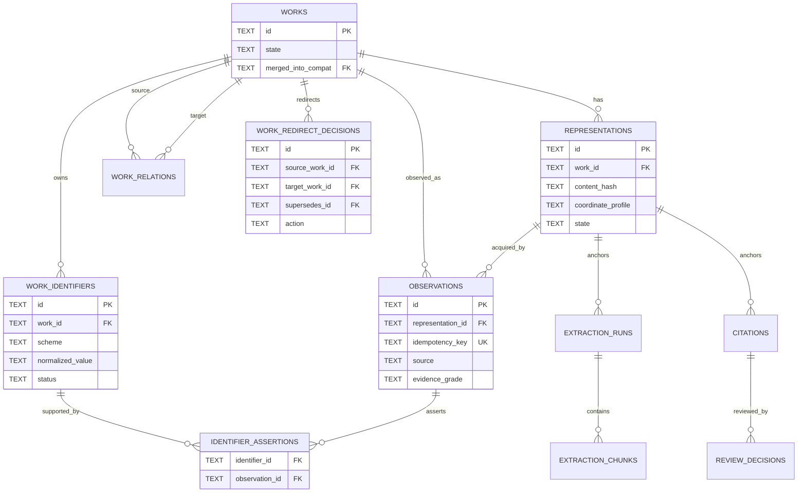
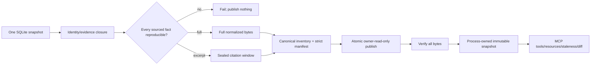
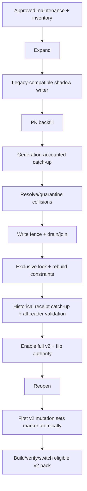

# OMO Ingestion Wave 2.1 Mass-ULW 통합 분석 보고서

- 작성일: 2026-08-20
- 기준선: `bed13a80b1bdbb9d605b0bc34c42771576ca310e`
- 성격: 의사결정 완료 실행 명세. 구현 완료 보고서가 아니다.
- 근거: `.omo/mass-ulw/20260820-ingestion-integration/01-source-reconciliation.md`부터 `07-synthesis-blueprint.md`까지

## 1. 경영진 판정

현재 기준선은 **주요 세 진입점의 필드 보존을 구현한 유효한 중간 기준선**이다. CLI collect, 동기 `/api/collect`, research worker는 공통 `ingest_documents()` seam을 사용하며 DOI/source/evidence grade를 전달한다. full-text enrichment는 `dataclasses.replace()`로 메모리 내 DOI/URI/source/evidence를 보존하고 `/api/documents`도 세 필드를 노출한다(`02-current-code.md`; `03-audit-evidence.md` C-008 REFUTE).

그러나 현재 제품은 손실 없는 수집 시스템이 아니다. 결함의 증거 등급과 심각도는 다음과 같이 구분한다.

- **[locked blocker]** C-023: populated legacy DOI를 backfill하지 않아 동일 Work가 분리된다.
- **[locked blocker]** C-024: full-text lifecycle의 소비자 경계가 richer ready Representation을 명시적으로 선택하지 못한다.
- **[locked blocker]** C-029: 구조화 DOI에도 `rstrip(".,;)")`를 적용해 합법적 종결 `)`를 훼손한다.
- **[feature blocker]** C-046(diff): forged pack diff가 verified opener를 우회한다. Core convergence NO-GO 근거와는 분리하며 diff feature는 수정 전 비활성화한다.
- **[locked blocker]** C-032, C-033/C-034, C-044, C-045/C-060: extraction identity/grounding, identifier decision, pack closure와 immutable serving 계약이 부족하다.
- **[feature blocker; current-source confirmed gap]** 다른 DOI의 같은 바이트를 전역 hash로 합칠 수 있다. 이는 설계 반례이자 현 코드 관찰이지만 독립 잠금 root로 격상하지 않는다.
- **[locally probed debt]** C-025: pack 문서 투영이 DOI를 누락한다. disposable pack probe로 기작은 확인했으나 prior-audit 심각도는 Normal이다.
- **[narrow non-blocking debt]** C-007 sample endpoint의 공통 seam 우회는 Low이며, C-027 DB/JSONL provenance 비원자성은 Normal audit-recovery debt다.

따라서 **Wave 2.1 convergence 출시는 적용 가능한 잠금 blocker C-023, C-024, C-029, C-032, C-033/C-034, C-044, C-045/C-060가 미해결이므로 NO-GO**다. C-046(diff)를 포함한 feature blocker와 좁은 debt는 별도 capability gate이며, core NO-GO와 같은 release class로 주장하지 않는다. 현재 허용되는 문구는 다음뿐이다.

> Wave 2.1 주요 진입점의 필드 보존은 구현되었다. Work/Representation/Observation 신원 마이그레이션과 pack 출판 계약은 계획되었으며 구현을 기다리고 있다.

## 2. 출처 조정과 증거 경계

| 출처 | 권위와 사용법 |
|---|---|
| GJC | 외부 근거와 4계층 대안. 구현 권위는 아니다. |
| HANDOFF | 세션 순서, 운영 제약, 허용 release wording의 우선 근거다. |
| R10 | 가장 상세한 계획. 열린 분기를 제외한 목표 설계의 우선 근거다. |
| `01-source-reconciliation.md` | IMPLEMENTED/PLANNED/DISPUTED 상태와 충돌 조정의 기준이다. |
| `02-current-code.md` | `bed13a8` 코드와 실행 probe 기반 현재 동작의 기준이다. |
| `03-audit-evidence.md` | KEEP/NARROW/REFUTE 및 독립 검증 범위의 기준이다. |
| `04-domain-architecture.md` | 세 축 Design B와 불변식의 규범이다. |
| `05-failure-analysis.md` | K1/K2, F1-F11과 rollback 경계의 규범이다. |
| `06-pack-contract.md` | evidence-self-contained pack v2/MCP 계약의 규범이다. |
| `07-synthesis-blueprint.md` | §0 Final execution authority correction과 이 보고서 §§6-9가 Step 1-10 실행 순서의 공동 규범이다. 과거 blueprint 본문과 충돌하면 §0/이 보고서가 우선한다. |

입력은 DOI가 문서 바이트 중복 키가 될 수 없고, citation이 가리키는 바이트와 좌표가 불변이어야 하며, SQLite outbox가 감사 진실이어야 한다는 데 합의한다. 모호한 신원은 fuzzy auto-merge가 아니라 HITL로 보내며, 전체 테스트 통과 수만으로 출시를 승인하지 않는다.

GJC의 Work -> Citable Version -> Representation -> Observation과 R10/HANDOFF의 세 축 모델 충돌은 `04-domain-architecture.md`의 비교에 따라 **세 축 Design B**로 종결한다. DOI를 가진 preprint와 VoR은 별도 Work이고 provenance-carrying `work_relations`로 연결한다. stage는 Observation metadata와 read-time projection이며 저장 cluster/version과 mutable preferred pointer는 만들지 않는다.

현재 결함으로 가져오는 잠금 감사 root는 C-023, C-024, C-029, C-032, C-033/C-034, C-044, C-045/C-060, pack-diff C-046뿐이다. C-008(full-text 메모리 내 provenance 소실)과 C-009(HTTP mock 기본값)는 반박 상태를 유지한다. C-065의 광범위 DOI 문법은 열린 단일 관찰이다. broad C-013, “path replacement가 이미 열린 inode를 바꾼다”, “tampered MCPB가 사실을 제공한다”도 blocker로 재활용하지 않는다(`03-audit-evidence.md` §§1-6).

C-036 stale bulk review race는 이 ingestion 구현 범위로 가져오지 않지만, `verified` review truth를 포함하는 reviewed/sourced pack의 **외부 출시 선행조건**이다. Step 8은 C-036 remediation receipt가 없으면 그런 pack을 build/verify할 수는 있어도 publish 또는 `reviewed`/`sourced-answer-v2`로 label할 수 없고, Step 10도 해당 capability를 GREEN으로 선언하지 않는다.

## 3. 구현됨 대 계획됨

### 3.1 구현되고 재확인됨

| 항목 | 현재 사실 | 한계 |
|---|---|---|
| 공통 seam | CLI, 동기 HTTP, research가 `ingest_documents()` 사용 | sample 우회 |
| 필드 보존 | 주요 경로에서 DOI/source/grade 저장 | Work/Observation 의미 미분리 |
| full-text enrichment | `dataclasses.replace()`로 필드 보존 | 같은 DOI의 새 persisted bytes는 버림 |
| DOI 우선 dedupe | DOI 조회 후 hash 조회 | global hash identity와 richer-body 손실 |
| 동시 insert 방어 | unique loser가 승자 행을 회수 | connection-wide rollback과 내부 commit |
| API 투영 | `/api/documents`가 DOI/source/grade 노출 | pack DOI 누락 |
| grounding 기초 | span 검증·rebasing과 citation 연결 | Representation receipt/waiver 없음 |
| pack graph 필터 | verified/current graph 행 선별 | identity/evidence closure 없음 |

### 3.2 계획되었고 아직 구현되지 않음

Work/Representation/Observation authority, immutable Representation lifecycle, populated backfill, collision quarantine, typed attach/retract/merge/compensate, transactional outbox, staged/ready/quarantined 파일 상태, Representation-scoped extraction, Citation·ReviewDecision receipt, grounding waiver, evidence-self-contained pack v2, immutable MCP snapshot, verified staleness/diff, production cutover와 forward-only rollback은 모두 계획 상태다. 본 문서의 의사결정 완료는 제품 구현 완료가 아니다.

## 4. 최종 결정 로그

| ID | 결정 | 선택 |
|---|---|---|
| D01 | 모델 | Work -> immutable Representation(`documents`) -> append-only Observation |
| D02 | DOI 권위 | accepted `work_identifiers`; `documents.doi`는 1-release deprecated projection |
| D03 | DOI 파싱 | structured identifier와 citation-prose parser 분리; 합법적 terminal `)` 보존 |
| D04 | 같은 DOI/다른 bytes | 1 Work, 2 Representations, 2 Observations; overwrite/discard 금지 |
| D05 | 다른 DOI/같은 bytes | 2 Works, 2 Representation rows; Work당 active accepted DOI 최대 1개. 두 번째 DOI attach는 원자적으로 거부하고 pending conflict를 남기며 관련 DOI 객체는 `work_relations`로 연결 |
| D06 | preprint/VoR | 별도 Works와 typed relation; cluster는 derived view |
| D07 | 선택 의미 | version/stage projection과 task-specific representation-completeness selection을 분리. extraction은 `ready`, usable full text, grade/source, stage, length, lexical hash 순이며 stage가 usable full text를 이기지 못함 |
| D08 | Observation retry | acquisition operation당 하나; 동일 operation retry만 idempotent, 별도 acquisition은 새 Observation |
| D09 | Work merge | human-only append-only `work_redirect_decisions`; current/as-of acyclic active projection으로 canonical 계산, compensation은 선행 decision을 supersede하며 Representation/citation/run FK 불변 |
| D10 | migration collision | 명백한 equivalent explicit/exact-resolver만 grouping; ambiguity는 accepted owner 없이 quarantine |
| D11 | alias authority | `source_attested`, `registry_supplied`, `human_asserted`, `model_unattested`; 마지막 유형만으로 CAS/EPPO 금지 |
| D12 | provenance | SQLite outbox가 진실, JSONL은 event-ID deterministic projection |
| D13 | 파일 | `staged -> ready -> quarantined`; ready만 소비 |
| D14 | grounding | 일반 cascade는 모든 member의 grounded Citation 필수; waiver는 별도 decision이며 default pack 제외 |
| D15 | pack v2 | MAJOR v2 evidence-self-contained, evidence mode는 `full|excerpt`; sourced fact의 `none` 금지 |
| D16 | legacy pack | v1 graph-only로 불변 보존, v2 승격·in-place rewrite 금지 |
| D17 | pack integrity | strict manifest/inventory, owner-read-only publish, process-owned immutable snapshot; hash는 integrity만 증명 |
| D18 | sample | 실제 `/api/collect/sample`을 production onboarding ingestion으로 보고 service v2에 수렴 |
| D19 | rollback | writer reopen 전 backup restore. reopen 후 restore는 write fence, writer drain/join, exclusive DB cutover lock 아래 marker 부재와 fresh inventory 동일성을 한 transaction에서 증명할 때만 허용; 첫 v2 authority mutation 후 forward-only |
| D20 | 성능 | `wave21-perf-v1`(seed `20260820`, 10,000 populated legacy documents, 5% DOI collision, 5% same-byte/different-DOI, canonical manifest)을 Step 1에서 동결. 기존 ingest/pack p95 20% 초과 회귀 금지; target migration은 Step 5 최초 baseline과 비교. payload 10% 초과는 Wave 2.1 Release Owner와 Evidence Governance Owner의 공동 승인 필요 |

명시적으로 거부한다: mutable “longest text wins”, 4계층 stored version/cluster, global hash identity, 자동 DOI/CAS/EPPO merge, arbitrary URI DOI inference, 이미 소실된 역사 fabrication, graph-only v2, dangling raw path, in-place pack repair, writer reopen 후 backup restore, synthesis 자체의 금지.

## 5. 목표 아키텍처와 불변식



1. accepted `(scheme, normalized_value)` active owner는 최대 하나이며, 각 Work의 active accepted DOI도 최대 하나다. 두 번째 DOI attach는 기존 owner를 바꾸지 않고 typed conflict와 pending decision을 남긴다.
2. content hash 일치는 Work equality/identifier attach의 충분조건이 아니다. 다른 DOI의 같은 bytes는 두 Work/Representation이고 관계는 `work_relations`로만 표현한다.
3. identifier reservation은 먼저 `work_identifiers`를 원자적으로 예약하고, Observation 생성 뒤 같은 transaction에서 append-only `identifier_assertions(identifier_id, observation_id)`를 삽입한다. 존재하지 않는 Observation을 가리키는 즉시 FK나 immutable field의 사후 갱신은 없다.
4. 기존 `documents.id`, raw path, node/edge/citation ID와 span target은 byte-identical하게 보존한다.
5. `raw_text_path`는 최초 insert부터 최종 상대 경로 `documents/{representation_id}/raw.txt`이고 불변이다. staging filename은 operation 소유 별도 경로이며 DB authority가 아니다.
6. ready Representation의 bytes/hash/path/profile은 불변이며 mismatch는 quarantine한다.
7. Observation/relation/redirect decision/identifier assertion/outbox는 append-only다. `canonical(work, as_of)`은 supersede/compensate를 적용한 당시 active acyclic redirect projection으로 계산한다.
8. extraction identity에는 `representation_id`가 포함되며 hash는 integrity assertion이다.
9. grounded Citation은 Representation/hash/profile, text/hash, window/hash, 좌표, run/chunk receipt를 가진다.
10. 일반 cascade는 모든 member를 먼저 검증하고 실패 시 아무것도 쓰지 않는다.
11. aggregate와 outbox는 같은 caller-owned transaction/SAVEPOINT에서 commit하며 내부 unconditional commit/rollback은 없다.
12. 모든 production ingestion entrypoint는 service v2만 통해 persistence에 도달한다.
13. pack은 한 SQLite snapshot에서 완전한 identity/evidence/method closure를 만들고 누락 시 fail closed한다.
14. pack open은 claim 소비 전 검증하고 immutable snapshot을 열며, 실패 시 기존 session을 유지한다.

```mermaid
stateDiagram-v2
    [*] --> staged : bytes write/fsync + DB aggregate/outbox
    staged --> ready : atomic rename + dir fsync + ready tx
    staged --> ready : startup reconciler finalizes valid file
    staged --> quarantined : missing/hash mismatch
    ready --> quarantined : integrity failure
    ready --> ready : extraction/citation/pack; bytes frozen
```





## 6. 개선된 실행 Step 1-10

각 Step은 공개 번호를 유지하되 아래 mergeable sub-increment로 나눈다. 각 sub-increment는 독립 receipt와 bounded binary gate를 가지며 review/revert 가능해야 하고, Step은 모든 sub-increment가 GREEN일 때만 GREEN이다. 고정 sleep, polling, retry-to-pass와 warning-only 판정은 금지한다.

### Step 1 — Characterization과 결정적 harness
- **1A fixtures/harness:** populated fixtures, canonical dump/hash, barrier/failpoint/bounded join, 실제 CLI/HTTP/research/sample/pack/stdio MCP harness를 만든다. timing-polled research test는 trigger 전 exact completion subscription을 설치하고 bounded timeout으로 기다린다.
- **1B characterization receipts:** same DOI/new bytes 손실, different DOI/same bytes collapse, legacy split, terminal `)` 훼손, sample bypass, pack DOI NULL은 **expected-failing target-invariant test** 또는 제품 GREEN과 격리된 characterization receipt로 기록한다. 현재 결함을 재현해 통과하는 테스트는 GREEN/release evidence가 아니다.
- **1C existing-operation performance:** `wave21-perf-v1` fixture recipe와 canonical manifest hash를 동결하고 legacy fixture create/open/no-op, current ingest, current pack의 median/p95를 기록한다. 아직 없는 target migration baseline은 기록하지 않는다.
- **Mutant 계약:** fixture 삭제/변경을 mutation proof로 세지 않는다. 각 소유 Step은 실제 decision point인 DOI early return, global hash lookup/constraint, `rstrip`, sample direct insert, pack projection mutant를 죽이고 Step 10 전 해당 characterization을 target-invariant GREEN으로 invert/retire한다.

### Step 2 — 좁은 DOI/v1 pack containment (`2A parser`, `2B v1 projection`, `2C verified opener/diff`)
- field-aware DOI parser, v1 pack DOI projection, shared verified-pack opener와 verified diff 또는 typed unavailable만 구현한다. v2 capability는 추가하지 않는다.
- 등록된 세 terminal-`)` DOI round-trip, live/v1 pack DOI 일치, forged diff 선제 실패가 GREEN이며 실제 `rstrip`, DOI projection omission, opener bypass implementation mutant를 죽인다.

### Step 3 — Additive authority schema (`3A schema`, `3B repositories/invariants`, `3C serializers/projection`)
- works/identifiers/relations, append-only identifier assertions와 redirect decisions, Representation state, Observations, outbox, ledger/readiness를 추가한다. identifier 예약 후 Observation과 assertion link를 같은 transaction에서 삽입하며 concurrent DOI reservation loser는 typed conflict를 받는다.
- 현재 global `UNIQUE(content_hash)`/partial DOI constraint가 권위인 production layout에서는 전체 v2 truth table GREEN을 주장하지 않는다. **disposable v2 constraint layout**에서만 two DOI/one hash, one DOI/two bytes, Work당 active DOI 최대 1개, second-DOI conflict, metadata-only Observation, preference 결정성을 증명한다.
- old `/api/documents` compatibility serializer는 유지하되 unsupported multi-Representation states를 typed unavailable로 표현한다. global identity, duplicate DOI owner, second DOI on one Work, stored pointer, redirect FK rewrite mutant를 죽인다.

### Step 4 — Identity decisions와 registry reconciliation (`4A DOI lifecycle`, `4B redirect compensation`, `4C registry aliases`)
- actor/reason/time 필수 list/attach/retract/merge/compensate/collision resolution과 CAS/EPPO candidate를 구현한다. `work_redirect_decisions`는 source/target/action/supersedes/actor/reason/time을 append-only로 저장하고 current/as-of canonical projection의 cycle을 거부한다.
- ambiguity는 pending record와 accepted owner 0개다. model-unattested alias만으로 canonical key를 만들지 않는다. compensation은 FK나 과거 decision을 바꾸지 않고 새 decision으로 이전 redirect를 supersede한다. current/as-of, cycle, compensation, authority-all, auto-merge, audit omission mutant를 죽인다.

### Step 5 — Resumable migration core on historical copies (`5A ledger/cursor`, `5B backfill/collision`, `5C readiness/fence rehearsal`)
- backup copy에서 immutable-PK cursor, source fingerprint, phase/generation ledger, catch-up/drift, exact-resolver-only derivation, collision reports, integrity classification, writer-generation accounting, fence와 marker machinery를 구현한다. controlled legacy-row injector로 F1/F6 및 cursor/catch-up/fence interruption을 검증하며 production cutover와 integrated new service writer F3는 소유하지 않는다.
- machine-readable readiness/generation만 노출한다. pack command refusal/F11은 Step 8 소유다. ambiguity owner/redirect 0, atomic checkpoint, rerun dump 동일, ID/path 불변을 요구한다.
- `wave21-perf-v1` 10k copy에서 최초 target-migration median/p95와 absolute CPU/RSS/disk/time budget을 기록한다. arbitrary inference, premature cursor, no catch-up, unresolved enforce mutant를 죽인다.

### Step 6 — Transactional ingestion service v2 (`6A caller-owned transaction`, `6B file lifecycle`, `6C outbox projector`, `6D entrypoints`)
- SAVEPOINT-aware `IngestOutcome`, operation-idempotent Observation, staged-file reconciliation, same-tx artifact/outbox, deterministic JSONL, partial batch와 CLI/HTTP/research/sample 수렴을 구현한다. DB에는 처음부터 final relative `raw_text_path`를 저장하고 operation staging file을 rename/fsync한 뒤 ready로 전이한다; crash failpoint가 finalizable/quarantined를 결정한다.
- old constraints가 살아 있는 pre-fence에는 **legacy-compatible shadow mode**만 허용한다. representable outcome을 atomically mirror하고 richer/conflicting outcome은 durable queue에 두며 full semantic dual-write라 부르지 않는다. full v2 write authority는 Step 9 constraint rebuild 뒤에만 켠다.
- v2 research extraction과 same-hash/two-Work materialization은 Step 7 readiness generation 전 typed `not_ready` 또는 durable queued 상태다. readiness 후 두 Representation-scoped materialization을 증명한다. internal commit/rollback, global hash decision, outbox omission, staged exposure, mutable raw path, sample direct insert mutant를 죽인다.

### Step 7 — Extraction/Citation/grounding receipts (`7A run/chunk`, `7B historical Citation migration`, `7C review/grounding`)
- Representation-scoped run, chunk range/profile/hash, Citation receipt, append-only ReviewDecision, all-member preflight, waiver, selection-policy receipt를 구현한다. version/stage projection과 extraction selection을 분리하고 extraction tuple을 `ready > usable full text > grade > source > stage > length > lexical hash`로 고정한다.
- C-024 fixture는 publisher `publishedVersion` abstract와 unknown-stage PMC full text를 함께 두고 **실제 research consumer가 PMC richer ready Representation을 선택해 추출**해야 GREEN이다. stage가 full text를 이기는 mutant를 죽인다.
- historical extraction runs/chunks/citations/reviews에 deterministic legacy receipt ID와 raw-byte seal을 부여하고 backup copy에서 rehearsal한다. unverifiable span은 추측 보정하지 않고 quarantine하며 모든 document/node/edge/citation anchor를 보존·분류한다. hash-run lookup, root-only validation, generic waiver mutant를 죽인다.

### Step 8 — Evidence-self-contained pack v2/MCP (`8A schema/closure`, `8B inventory/verifier`, `8C snapshot/readers`)
- 한 snapshot의 완전 closure, `full|excerpt`, dynamic inventory, strict claim re-derivation, atomic owner-read-only publish, immutable serving copy, common verified opener, standalone verifier/stdio를 구현한다.
- Step 5 readiness generation을 소비하고 non-ready/incomplete generation의 publication을 거부하는 F11을 단독 소유한다. closure/receipt 누락, `none`, dangling path, `0644`, original inode, opener bypass mutant를 죽인다.
- `verified` ReviewDecision을 포함한 reviewed/sourced pack publish와 capability label은 별도 C-036 remediation receipt를 입력 manifest에 기록한 경우만 허용한다. receipt가 없으면 unreviewed fixture verification만 가능하고 reviewed/sourced release는 fail closed한다.

### Step 9 — Integration, cutover와 forward rollback (`9A disposable rehearsal`, `9B operator runbook approval`, `9C authorized production execution`)
- 9A는 production-equivalent Step 6 binary와 controlled old binary를 사용해 F3를 단독 소유하고 expand -> shadow write -> backfill -> catch-up -> drain/fence -> constraint rebuild -> full-v2 enable -> authority flip을 backup copy에서 rehearsal한다. Step 7 historical receipt migration도 재생한다.
- 9B는 backup-API rehearsal receipt, 모든 reader zero-drift receipt, rollback drill과 maintenance-window runbook을 운영자가 승인하는 코드/계획 완료 경계다. 9C production 실행은 이름 붙은 maintenance window의 **별도 명시 승인** 없이는 시작하지 않는다.
- old writers를 drain/join하고 exclusive cutover lock을 잡은 뒤 legacy global hash/DOI constraints를 transactionally rebuild하고 zero-unmigrated-row를 검증한다. full v2 write와 research extraction은 그 뒤 readiness generation에 묶어 켠다.
- F7/F8와 F10 end-to-end를 소유한다. marker는 ingestion뿐 아니라 identity decision, extraction/review, publication state를 포함한 첫 irreversible v2 authority mutation과 같은 transaction에서 설정한다. fence/marker/FK/reader drift/pack mutation mutant를 죽인다.

### Step 10 — Release mutation/evidence report
- 새 semantics나 최초 구현 없이 owner Step의 invariant -> test -> implementation mutant -> surface -> artifact hash receipt를 한 bounded run으로 재집계한다. owner에서 이미 죽지 않은 mutant, retire되지 않은 characterization, first-time migration/production behavior가 있으면 실패한다.
- F1-F11과 historical receipt migration이 모두 GREEN이고, release-candidate target migration을 Step 5 baseline과 비교하며 Step 1 baseline은 기존 ingest/pack 비교에만 쓴다. 동일 snapshot/policy payload root를 요구한다.
- C-036 receipt가 없으면 reviewed/sourced capability는 명시적으로 제외한다. receipt가 있으면 hash/authority를 release receipt에 포함하고 그 capability만 주장한다.

## 7. Edge 검증 행렬

| 필수 edge | 단독 Step | 시나리오 | GREEN 조건 |
|---|---:|---|---|
| Populated DOI migration/collision | 5 | F1 | equivalent owner 1+all reps; ambiguity owner/redirect 0; rerun 동일 |
| Concurrent v2 writers | 6 | F2 | truth table, sentinel 보존, outbox 완전 |
| Old/new writer during backfill | 9 | F3 | 실제 old binary와 production-equivalent shadow writer; generation-accounted catch-up zero drift; fenced old mutation 0 |
| DB/filesystem/provenance failure | 6 | F4 | absent/finalizable staged/valid ready/typed quarantine; final path 불변 |
| Outbox replay/torn mirror | 6 | F5 | logical event 정확히 1개, durable mirror 전 mark 없음 |
| Migration interrupt/resume | 5 | F6 | ledger/cursor 결정적 resume, rerun dump 동일 |
| Dual-write cutover | 9 | F7 | 모든 supported reader 일치, one-sided commit 없음, flag data-neutral |
| Rollback after extraction/review | 9 | F8 | quiescence 없이는 restore 거부; marker 후 forward-only; row/file/span/event 보존 |
| Source policy change/C-024 | 7 | F9 | old receipt 고정; 실제 consumer가 richer ready full text 선택 |
| Retraction/false attach/merge | 4/9 | F10 | Step 4 decision semantics; Step 9 end-to-end; anchor/old pack 불변 |
| Pack during migration | 8 | F11 | non-ready publish 불가, ready는 단일 snapshot/generation |
| Historical extraction/chunk/citation migration | 7/9 | H1 | Step 7 backup rehearsal; Step 9 catch-up/enforce; 모든 anchor 보존, unverifiable span quarantine, unmigrated 0 |

Audit root 소유권은 C-023 Step 5, C-024 Step 7, C-029/C-046 Step 2, C-032 Step 7, C-033/C-034 Step 4, C-044/C-045/C-060 Step 8이다. F3는 Step 9, F11은 Step 8만 소유한다. F10의 Step 4 decision-unit gate와 Step 9 integration gate는 서로 다른 시나리오다. Step 10은 재집계이지 중복 소유가 아니다.

## 8. Migration, cutover, rollback

### 사전 조건
1. SQLite backup API backup과 DB/file inventory restore hash가 일치한다.
2. copy에서 Step 5 F1/F6와 Step 9 F3 rehearsal을 두 번 실행해 idempotency가 GREEN이다.
3. collision queue가 가동되고 blocking collision은 해결되거나 accepted authority가 0이다.
4. shadow-write telemetry, writer-generation accounting, drift query를 backfill 전에 배포한다.
5. old writer 전부를 열거하고 실제 old binary로 drain/join/fence를 검증한다.
6. Step 7 historical receipt migration과 Step 8 verifier/real stdio MCP가 migrated copy에서 GREEN이다.
7. 9B runbook과 maintenance window가 승인되기 전 9C production 실행을 금지한다.



두 zero-drift pass는 각각 writer generation과 transaction high-water mark를 기록해야 하며 snapshot 두 번만으로 충분하지 않다. 최종 drain/join/fence와 exclusive lock이 결정적 gate다. non-zero drift, unresolved blocking collision, hash/FK/Citation 실패, old writer fence 실패, outbox 누락, verifier 실패 또는 rollback receipt 누락은 자동 abort다.

### Dual-read authority matrix

| Reader | legacy authority | v2 authority / shadow 비교 | unsupported v2 state와 switch/rollback |
|---|---|---|---|
| `/api/documents` | `documents` legacy columns | compatibility canonical dump vs Work/Representation generation | multi-Representation-per-DOI는 typed unavailable; Step 9 switch, forward rollback은 faithful read-only만 |
| extraction selection/state | content-hash run lookup | explicit Representation + readiness/policy receipt | Step 7 전 same-hash/two-Work는 queued/`not_ready`; Step 9 generation switch |
| review context | legacy citation/document join | Citation/ReviewDecision sealed receipts | missing/unverifiable anchor는 quarantine/typed unavailable; compensation only |
| artifacts/staleness | legacy document/hash views | generation-bound identity/extraction canonical dump | lossy projection 금지; Step 9 switch/compatible read-only |
| pack build | working-store rows/path | one-snapshot v2 closure + readiness | non-ready는 Step 8 typed refusal; published pack 불변 |
| diff | v1 verified graph comparison | shared verified opener + v2 identity/evidence roots | unsupported major는 typed unavailable; 기존 verified session 유지 |
| MCP discovery/load | original verified path | process-owned immutable snapshot | verification/snapshot 실패 시 switch 금지, previous session 유지 |
| direct repositories | legacy KGStore methods | typed v2 repositories + generation | cutover 뒤 legacy mutator 차단; unrepresentable read typed unavailable |

각 operation은 하나의 readiness generation을 bind한다. Step 9은 위 모든 supported reader의 canonical dump zero drift를 요구하고, old reader가 표현할 수 없는 상태에서는 silent lossy serialization 대신 unavailable을 요구한다.

### Restore와 compatibility 경계

- **writer reopen 전:** write fence와 exclusive lock 아래 DB와 pre-cutover file inventory를 함께 backup restore할 수 있다.
- **reopen 후 marker 전:** 먼저 새 write를 거부하고 모든 writer/process를 drain/join한 뒤 exclusive DB cutover lock을 잡는다. 그 lock 아래 한 transaction에서 모든 v2-authority marker 부재와 zero drift를 증명하고, 잠금 후 새로 측정한 file inventory를 pre-cutover inventory와 비교한 경우만 DB+files를 함께 restore한다. staging/fsync/in-flight transaction까지 quiescent임을 증명하지 못하면 restore를 금지하고 forward-only다.
- **첫 v2 authority mutation 후:** ingestion, identity, extraction/review 또는 publication mutation과 같은 transaction에서 `post_cutover_write`를 세운다. 이후 DB restore, schema contraction, old writer 재활성화를 영구 금지한다. v2 writes를 fence하고 충실한 compatibility read-only/degraded service만 제공하며 표현 불가능한 read는 typed unavailable이다.
- **extraction/review/pack 후:** audited append-only compensation과 새 pack으로 복구한다. row 삭제, FK rewrite, timestamp clear, in-place pack mutation은 금지한다.
- compatibility window는 **Step 9 authority cutover에서 시작**하고 최소 한 release 동안 유지한다. `documents.doi/source/evidence_grade`와 legacy index/column contraction은 telemetry가 legacy reader 0을 증명한 뒤의 별도 out-of-scope release다. 첫 v2 write 뒤 additive schema, receipts, files, outbox는 영구 보존한다.

## 9. 금지된 주장

Step 10 receipt 전에는 다음을 주장하지 않는다.

- “Wave 2.1/R10 구현 완료”, “lossless ingestion”, “모든 entrypoint 수렴”, “DOI migration 완료”
- “DOI가 모든 scholarly Work를 고유하게 정의한다”, “content hash가 Work를 식별한다”
- “full-text reconstruction이 DOI/source/evidence를 잃었다”, “HTTP extraction 기본값이 mock이다” — 둘 다 반박됨
- “synthesis는 금지된다”, “human approval이 evidence를 만든다”
- “모든 alias가 무효”, “같은 CAS auto-merge”, “KGStore가 registry policy 소유”
- receipt 누락 상태의 “evidence-self-contained/sourced-answer-v2”
- C-036 remediation receipt 없는 `verified` truth의 “reviewed/sourced pack release”
- “hash가 builder를 인증한다” — integrity만 증명
- broad “path replacement/tampered MCPB가 현재 attacker fact를 serve한다”
- post-cutover write 뒤 “backup restore가 rollback이다”
- mutation과 실제 surface receipt 없이 “tests GREEN이므로 product GREEN이다”

허용 단계 문구: Step 2 후에는 DOI terminal-parenthesis/v1 DOI/diff 수정만, Step 3-8 fixture 후에는 production cutover 미수행을 함께, Step 9 후에는 release verification pending을 함께 말한다. Step 10 후에도 receipt가 명명한 capability만 주장한다.

## 10. 정확한 OMO 프롬프트

아래 kickoff prompt는 수정된 Step 1 증거 계약을 따른다.

```text
You are implementing Wave 2.1 ingestion integration in /Users/hyunjun/Documents/MUNI/ontologylab at baseline bed13a80b1bdbb9d605b0bc34c42771576ca310e.

Read docs/OMO-INGESTION-WAVE-2.1-MASS-ULW-INTEGRATED-ANALYSIS-2026-08-20.md and its cited 01-09 artifacts. Implement Step 1 only: frozen historical fixtures, deterministic concurrency/failpoint/surface harnesses, exact subscribed research completion, isolated characterization receipts, and existing-operation performance baselines. Do not implement Step 2+ product behavior or an unimplemented target-migration baseline.

Requirements:
- Encode same DOI/new bytes, different DOI/same bytes, populated legacy resolver DOI, registered terminal-`)` DOI, sample seam bypass, and packed DOI loss as expected-failing target invariants or isolated characterization receipts. A test that passes by reproducing a defect is not GREEN release evidence.
- Freeze the wave21-perf-v1 recipe (seed 20260820, 10,000 populated rows, specified collision ratios) and record its canonical manifest hash. Baseline legacy create/open/no-op and current ingest/pack only.
- Exercise direct service, installed CLI, HTTP collect, research worker, /api/collect/sample, real pack build, and real stdio MCP where Step 1 specifies.
- Subscribe to the exact terminal event before triggering async work and await it with a bounded timeout. Fixed sleeps, polling, retry-to-pass, warning-only assertions, and unbounded waits are forbidden.
- Do not call fixture edits mutation proof. Record the later implementation mutants and owners: DOI early return/global hash constraint (Steps 5/6), rstrip (Step 2), sample direct insert (Step 6), pack projection (Step 2).
- Tests must assert machine-consumed state/receipts, not prose.
- Do not edit source planning documents, .omo artifacts, live data, or existing packs. Do not create a git commit.
- Run diagnostics on every changed file, the related tests once, and affected runnable surfaces. Fix only failures caused by this Step; report pre-existing failures separately.

Stop only when Step 1 characterization/harness/surface receipts are produced in one bounded run and no current defect reproduction is called GREEN. Report changed paths, exact commands/results, receipt locations/hashes, and remaining blockers. End with a verbatim kickoff prompt for Step 2 that cites the canonical report and actual Step 1 receipt paths; do not claim lossless ingestion, entrypoint convergence, migration completion, pack v2, or R10 completion.
```

## 11. 참조

1. `.omo/mass-ulw/20260820-ingestion-integration/01-source-reconciliation.md` — 상태 조정, 충돌, 누락 결정, overclaim.
2. `.omo/mass-ulw/20260820-ingestion-integration/02-current-code.md` — 기준선 코드·테스트·pack probe.
3. `.omo/mass-ulw/20260820-ingestion-integration/03-audit-evidence.md` — KEEP/NARROW/REFUTE와 독립 verifier.
4. `.omo/mass-ulw/20260820-ingestion-integration/04-domain-architecture.md` — Design B, schema, lifecycle, invariants, V1-V7.
5. `.omo/mass-ulw/20260820-ingestion-integration/05-failure-analysis.md` — K1/K2, F1-F11, rollback.
6. `.omo/mass-ulw/20260820-ingestion-integration/06-pack-contract.md` — pack v2, Citation receipt, manifest/MCP/legacy 계약.
7. `.omo/mass-ulw/20260820-ingestion-integration/07-synthesis-blueprint.md` — 최종 결정, Steps, cutover, exact prompt.
8. `docs/WAVE-2.1-DEEP-RESEARCH-REMEDIATION-GJC-2026-08-20.md`.
9. `docs/OMO-INGESTION-WAVE-2.1-IMPLEMENTATION-HANDOFF-2026-08-20.md`.
10. `docs/INGESTION-WAVE-2.1-RECURSIVE-PLAN-R10-2026-08-20.md`.

## 12. 현재 출시 판정

**현재 출시 판정: NO-GO — core convergence는 적용 가능한 잠금 root C-023, C-024, C-029, C-032, C-033/C-034, C-044, C-045/C-060가 미해결이다. C-046(diff)는 High feature blocker로 분리하며 core convergence NO-GO root로 격상하지 않는다. Work/Representation/Observation 마이그레이션과 evidence-self-contained pack v2는 계획 상태이며 구현·cutover·Step 10 검증을 기다린다. C-036 receipt 전에는 reviewed/sourced pack capability를 출시 범위에서 제외한다.**


## 13. Review disposition

### `08-skeptic-review.md`

| Mandatory item | Disposition |
|---|---|
| S1 F3 dependency | **Resolved.** F3 sole owner를 Step 9로 이동해 실제 old binary와 Step 6 production-equivalent shadow writer 뒤에 실행한다. Step 5는 migration core/fence machinery만 소유한다(§§6-7). |
| S2 post-reopen restore race | **Resolved.** write refusal, writer drain/join, exclusive lock, transactional marker proof, fresh locked inventory 비교를 모두 요구하며 미증명 시 forward-only다(§8). |
| S3 one DOI per Work | **Resolved.** Work당 active accepted DOI 최대 1개, second attach typed conflict/pending decision, relation-only linkage와 binary mutants를 명시했다(§§4-6). |
| S4 C-024 selection | **Resolved.** stage projection과 completeness selection을 분리하고 usable full text가 stage에 우선한다. 실제 research consumer fixture가 PMC full text를 추출해야 한다(§§4, 6-7). |
| S5 characterization/mutation proof | **Resolved.** defect reproduction을 expected-failing invariant/isolated receipt로 격리하고 GREEN에서 제외했다. 실제 decision-point implementation mutants와 Step 10 전 invert/retire를 요구한다(§§6, 10). |
| S6 evidence attribution | **Resolved.** C-023은 legacy backfill, C-024는 richer Representation selection으로 분리하고 C-046(diff)는 feature blocker로 격리했다. Core NO-GO는 적용 가능한 locked roots에만 귀속한다(§§1-2, 12). |
| S7 C-036 release prerequisite | **Resolved.** 구현은 외부 범위로 유지하되 reviewed/sourced publish와 Step 10 claim을 C-036 receipt에 fail-closed로 묶었다(§§2, 6, 9, 12). |
| S8 performance fixture/approver | **Resolved.** `wave21-perf-v1`의 seed, 규모, collision 구성과 canonical manifest를 동결하고 payload 예외 공동 승인자를 Wave 2.1 Release Owner/Evidence Governance Owner로 지정했다(§§4, 6). |

### `09-implementability-review.md`

| Mandatory item | Disposition |
|---|---|
| I1 F3 ownership | **Resolved.** Step 9/F3 sole ownership; Step 5는 cursor/catch-up/fence unit과 interruption만 담당한다(§§6-7). |
| I2 F11 reverse dependency | **Resolved.** Step 5는 readiness fixture만 노출하고 pack refusal/F11은 Step 8만 소유한다(§§6-7). |
| I3 legacy constraints/shadow mode | **Resolved.** Step 3 GREEN은 disposable v2 layout으로 제한하고 pre-fence legacy-compatible shadow mode와 Step 9 constraint rebuild/full enable을 정의했다(§§6, 8). |
| I4 Observation assertion ordering | **Resolved.** identifier 예약 후 Observation과 append-only `identifier_assertions` link를 같은 transaction에 삽입하는 executable FK 순서를 선택하고 concurrent reservation gate를 추가했다(§§5-6). |
| I5 false-merge compensation | **Resolved.** append-only `work_redirect_decisions`, supersede/compensate, current/as-of acyclic projection을 정의했다(§§4-6). |
| I6 staging path | **Resolved.** DB에는 최초부터 immutable final relative path를 저장하고 staging filename은 operation-owned 별도 경로로 정의했다. rename/fsync/recovery failpoint는 Step 6 소유다(§§5-6). |
| I7 historical extraction/citation migration | **Resolved.** Step 7이 additive receipt migration과 backup rehearsal, Step 9이 production catch-up/enforcement를 소유하고 H1 binary scenario를 추가했다(§§6-8). |
| I8 extraction readiness gate | **Resolved.** Step 7 readiness 전 v2 research extraction/full semantic writes를 queued/typed `not_ready`로 막고 이후 two-Representation materialization을 검증한다(§6). |
| I9 complete dual-read matrix | **Resolved.** API, extraction, review, artifacts/staleness, pack, diff, MCP, direct repository별 authority, generation, unsupported state, switch/rollback을 열거하고 Step 9 all-reader zero drift를 요구한다(§8). |
| I10 compatibility/forward rollback | **Resolved.** window 시작을 Step 9 cutover로 정하고 contraction은 후속 release로 미뤘다. 첫 v2 write 뒤 old writer 재활성화를 금지하고 faithful read-only/typed unavailable만 허용한다(§8). |
| I11 migration performance baseline | **Resolved.** Step 1은 기존 operation만 baseline하고 최초 target migration은 Step 5에서 측정해 Step 10 RC와 비교한다(§§4, 6). |
| I12 reviewable increments/production authorization | **Resolved.** Steps 2-9를 named sub-increments로 나누고 9A rehearsal, 9B operator approval, 9C separately authorized maintenance-window execution을 분리했다(§§6, 8). |
| I13 marker coverage | **Resolved.** marker를 ingestion뿐 아니라 identity, extraction/review, publication을 포함한 첫 irreversible v2 authority mutation과 같은 transaction에서 설정한다(§§6, 8). |
| I14 report/blueprint consistency | **Resolved.** `07-synthesis-blueprint.md` §0에 이 보고서와 동일한 forward-only dependency, F1-F11/H1 ownership, audit-root ownership, Step 9 authorization, rollback marker를 추가했다. §0과 이 보고서 §§6-9가 공동 실행 권위이며 과거 blueprint 본문과 충돌하면 이를 우선한다. |
